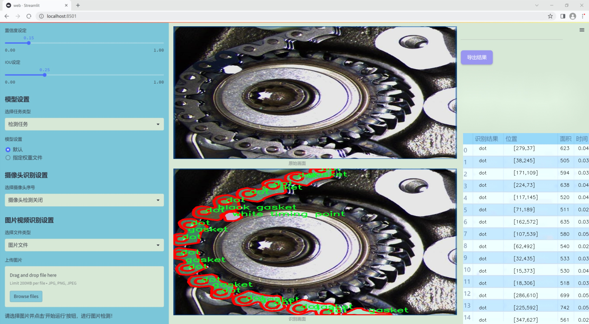
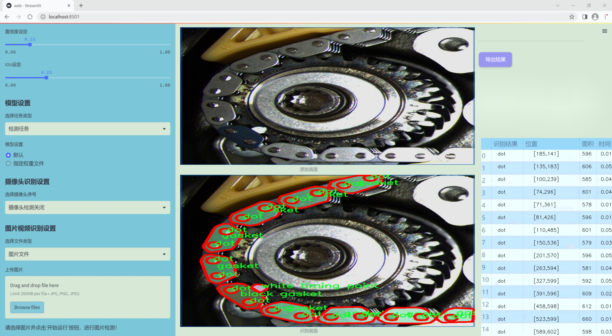
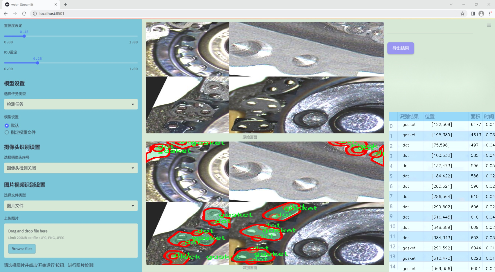
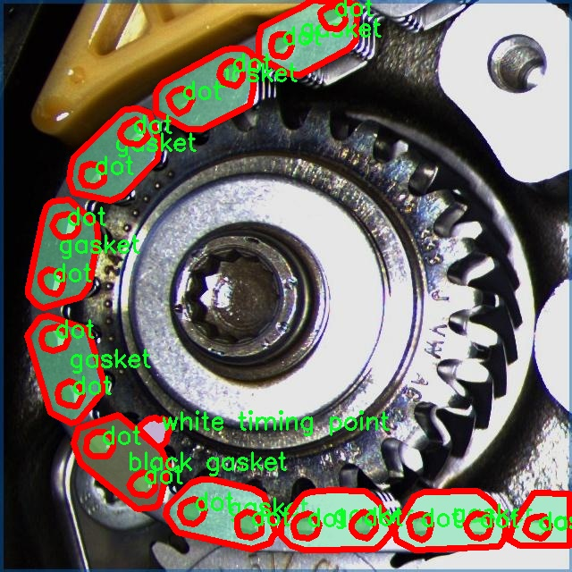
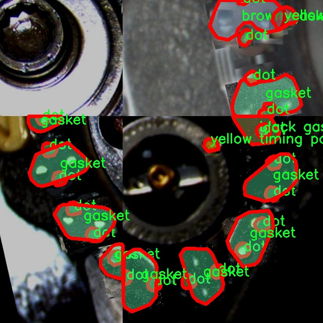
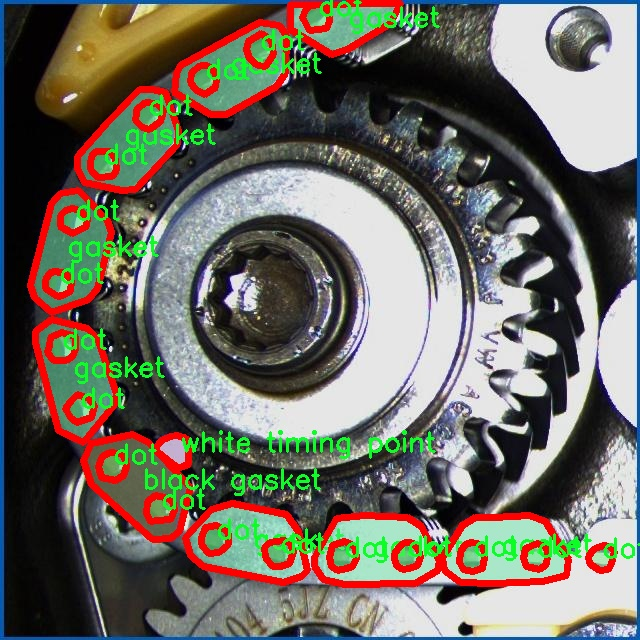
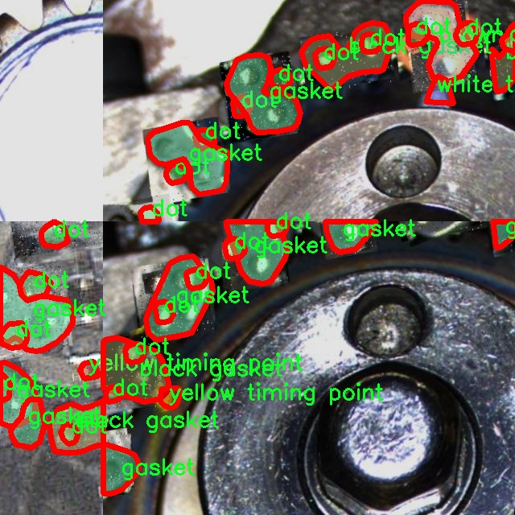
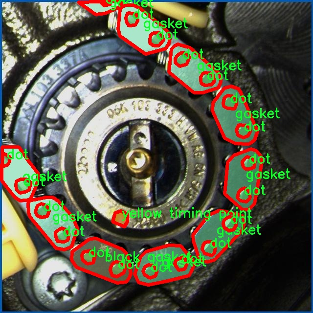

### 1.背景意义

研究背景与意义

随着工业自动化和智能制造的迅速发展，机器视觉技术在生产线上的应用日益广泛，尤其是在产品质量检测和定位系统中。链条作为许多机械设备中不可或缺的组成部分，其精确定位和检测对设备的正常运行至关重要。传统的链条检测方法往往依赖于人工观察和经验判断，效率低下且容易受到人为因素的影响。因此，基于深度学习的自动化检测系统应运而生，成为提升生产效率和保证产品质量的重要手段。

本研究旨在基于改进的YOLOv11算法，构建一个高效的链条定位检测系统。YOLO（You Only Look Once）系列算法以其快速和准确的特性在目标检测领域取得了显著成果。通过对YOLOv11的改进，我们希望能够进一步提升链条检测的精度和速度，满足工业生产中对实时性和准确性的高要求。我们的数据集“Chains_Positioning_det”包含六类不同的链条组件，包括黑色垫圈、棕色垫圈、点、垫圈、白色定时点和黄色定时点，共计2018张经过精细标注的图像。这些图像不仅涵盖了多种链条组件的外观特征，还经过了多种数据增强处理，以提高模型的泛化能力。

通过构建基于YOLOv11的链条定位检测系统，我们期望能够实现对链条组件的快速、准确识别和定位，从而为工业生产提供有效的技术支持。此外，该系统的成功应用将为其他类似的视觉检测任务提供参考，推动机器视觉技术在更广泛领域的应用与发展。

### 2.视频效果

[2.1 视频效果](https://www.bilibili.com/video/BV1eAmqYpETA/)

### 3.图片效果







##### [项目涉及的源码数据来源链接](https://kdocs.cn/l/cszuIiCKVNis)**

注意：本项目提供训练的数据集和训练教程,由于版本持续更新,暂不提供权重文件（best.pt）,请按照6.训练教程进行训练后实现上图演示的效果。

### 4.数据集信息

##### 4.1 本项目数据集类别数＆类别名

nc: 6
names: ['black gasket', 'brown gasket', 'dot', 'gasket', 'white timing point', 'yellow timing point']


该项目为【图像分割】数据集，请在【训练教程和Web端加载模型教程（第三步）】这一步的时候按照【图像分割】部分的教程来训练

##### 4.2 本项目数据集信息介绍

本项目数据集信息介绍

本项目所使用的数据集名为“Chains_Positioning_det”，旨在为改进YOLOv11的链条定位检测系统提供高质量的训练数据。该数据集专注于链条定位相关的物体检测，包含六个不同的类别，分别为“black gasket”、“brown gasket”、“dot”、“gasket”、“white timing point”和“yellow timing point”。这些类别涵盖了链条系统中关键的组件和标识点，具有重要的实际应用价值。

在数据集的构建过程中，我们特别注重样本的多样性和代表性，以确保模型能够在各种环境和条件下进行有效的检测。每个类别的样本均经过精心挑选和标注，确保数据的准确性和一致性。通过对不同光照、角度和背景下的样本进行采集，我们力求让模型具备更强的泛化能力，从而在实际应用中表现出色。

数据集的设计不仅考虑了物体的外观特征，还兼顾了它们在链条系统中的功能和相互关系。例如，黑色和棕色垫圈作为链条的关键组成部分，具有不同的物理特性和应用场景，而白色和黄色时标则在定位和调节链条张力方面发挥着重要作用。通过对这些类别的深入分析，我们希望模型能够更好地理解和识别链条系统中的各个组件，从而提高定位精度和效率。

此外，为了确保数据集的可用性和实用性，我们还进行了数据增强处理，包括旋转、缩放和翻转等操作，以进一步丰富样本的多样性。这一系列的努力旨在为改进YOLOv11提供一个全面、准确且高效的训练基础，使其在链条定位检测任务中达到更高的性能水平。通过这一数据集的训练，我们期望能够推动链条定位技术的发展，为相关领域的应用提供强有力的支持。











### 5.全套项目环境部署视频教程（零基础手把手教学）

[5.1 所需软件PyCharm和Anaconda安装教程（第一步）](https://www.bilibili.com/video/BV1BoC1YCEKi/?spm_id_from=333.999.0.0&vd_source=bc9aec86d164b67a7004b996143742dc)


[5.2 安装Python虚拟环境创建和依赖库安装视频教程（第二步）](https://www.bilibili.com/video/BV1ZoC1YCEBw?spm_id_from=333.788.videopod.sections&vd_source=bc9aec86d164b67a7004b996143742dc)

### 6.改进YOLOv11训练教程和Web_UI前端加载模型教程（零基础手把手教学）

[6.1 改进YOLOv11训练教程和Web_UI前端加载模型教程（第三步）](https://www.bilibili.com/video/BV1BoC1YCEhR?spm_id_from=333.788.videopod.sections&vd_source=bc9aec86d164b67a7004b996143742dc)


按照上面的训练视频教程链接加载项目提供的数据集，运行train.py即可开始训练



     Epoch   gpu_mem       box       obj       cls    labels  img_size
     1/200     20.8G   0.01576   0.01955  0.007536        22      1280: 100%|██████████| 849/849 [14:42<00:00,  1.04s/it]
               Class     Images     Labels          P          R     mAP@.5 mAP@.5:.95: 100%|██████████| 213/213 [01:14<00:00,  2.87it/s]
                 all       3395      17314      0.994      0.957      0.0957      0.0843

     Epoch   gpu_mem       box       obj       cls    labels  img_size
     2/200     20.8G   0.01578   0.01923  0.007006        22      1280: 100%|██████████| 849/849 [14:44<00:00,  1.04s/it]
               Class     Images     Labels          P          R     mAP@.5 mAP@.5:.95: 100%|██████████| 213/213 [01:12<00:00,  2.95it/s]
                 all       3395      17314      0.996      0.956      0.0957      0.0845

     Epoch   gpu_mem       box       obj       cls    labels  img_size
     3/200     20.8G   0.01561    0.0191  0.006895        27      1280: 100%|██████████| 849/849 [10:56<00:00,  1.29it/s]
               Class     Images     Labels          P          R     mAP@.5 mAP@.5:.95: 100%|███████   | 187/213 [00:52<00:00,  4.04it/s]
                 all       3395      17314      0.996      0.957      0.0957      0.0845


###### [项目数据集下载链接](https://kdocs.cn/l/cszuIiCKVNis)

### 7.原始YOLOv11算法讲解

##### YOLO11简介

> YOLO11源码地址：https://github.com/ultralytics/ultralytics

Ultralytics
YOLO11是一款尖端的、最先进的模型，它在之前YOLO版本成功的基础上进行了构建，并引入了新功能和改进，以进一步提升性能和灵活性。YOLO11设计快速、准确且易于使用，使其成为各种物体检测和跟踪、实例分割、图像分类以及姿态估计任务的绝佳选择。  


**YOLO11创新点如下:**

YOLO 11主要改进包括：  
`增强的特征提取`：YOLO 11采用了改进的骨干和颈部架构，增强了特征提取功能，以实现更精确的目标检测。  
`优化的效率和速度`：优化的架构设计和优化的训练管道提供更快的处理速度，同时保持准确性和性能之间的平衡。  
`更高的精度，更少的参数`：YOLO11m在COCO数据集上实现了更高的平均精度（mAP），参数比YOLOv8m少22%，使其在不影响精度的情况下提高了计算效率。  
`跨环境的适应性`：YOLO 11可以部署在各种环境中，包括边缘设备、云平台和支持NVIDIA GPU的系统。  
`广泛的支持任务`：YOLO 11支持各种计算机视觉任务，如对象检测、实例分割、图像分类、姿态估计和面向对象检测（OBB）。

**YOLO11不同模型尺寸信息：**

YOLO11 提供5种不同的型号规模模型，以满足不同的应用需求：

Model| size (pixels)| mAPval 50-95| Speed CPU ONNX (ms)| Speed T4 TensorRT10
(ms)| params (M)| FLOPs (B)  
---|---|---|---|---|---|---  
YOLO11n| 640| 39.5| 56.1 ± 0.8| 1.5 ± 0.0| 2.6| 6.5  
YOLO11s| 640| 47.0| 90.0 ± 1.2| 2.5 ± 0.0| 9.4| 21.5  
YOLO11m| 640| 51.5| 183.2 ± 2.0| 4.7 ± 0.1| 20.1| 68.0  
YOLO11l| 640| 53.4| 238.6 ± 1.4| 6.2 ± 0.1| 25.3| 86.9  
YOLO11x| 640| 54.7| 462.8 ± 6.7| 11.3 ± 0.2| 56.9| 194.9  
  
**模型常用训练超参数参数说明：**  
`YOLOv11
模型的训练设置包括训练过程中使用的各种超参数和配置`。这些设置会影响模型的性能、速度和准确性。关键的训练设置包括批量大小、学习率、动量和权重衰减。此外，优化器、损失函数和训练数据集组成的选择也会影响训练过程。对这些设置进行仔细的调整和实验对于优化性能至关重要。  
**以下是一些常用的模型训练参数和说明：**

参数名| 默认值| 说明  
---|---|---  
`model`| `None`| 指定用于训练的模型文件。接受指向 `.pt` 预训练模型或 `.yaml`
配置文件。对于定义模型结构或初始化权重至关重要。  
`data`| `None`| 数据集配置文件的路径（例如
`coco8.yaml`).该文件包含特定于数据集的参数，包括训练数据和验证数据的路径、类名和类数。  
`epochs`| `100`| 训练总轮数。每个epoch代表对整个数据集进行一次完整的训练。调整该值会影响训练时间和模型性能。  
`patience`| `100`| 在验证指标没有改善的情况下，提前停止训练所需的epoch数。当性能趋于平稳时停止训练，有助于防止过度拟合。  
`batch`| `16`| 批量大小，有三种模式:设置为整数(例如，’ Batch =16 ‘)， 60% GPU内存利用率的自动模式(’ Batch
=-1 ‘)，或指定利用率分数的自动模式(’ Batch =0.70 ')。  
`imgsz`| `640`| 用于训练的目标图像尺寸。所有图像在输入模型前都会被调整到这一尺寸。影响模型精度和计算复杂度。  
`device`| `None`| 指定用于训练的计算设备：单个 GPU (`device=0`）、多个 GPU (`device=0,1`)、CPU
(`device=cpu`)，或苹果芯片的 MPS (`device=mps`).  
`workers`| `8`| 加载数据的工作线程数（每 `RANK` 多 GPU 训练）。影响数据预处理和输入模型的速度，尤其适用于多 GPU 设置。  
`name`| `None`| 训练运行的名称。用于在项目文件夹内创建一个子目录，用于存储训练日志和输出结果。  
`pretrained`| `True`| 决定是否从预处理模型开始训练。可以是布尔值，也可以是加载权重的特定模型的字符串路径。提高训练效率和模型性能。  
`optimizer`| `'auto'`| 为训练模型选择优化器。选项包括 `SGD`, `Adam`, `AdamW`, `NAdam`,
`RAdam`, `RMSProp` 等，或 `auto` 用于根据模型配置进行自动选择。影响收敛速度和稳定性  
`lr0`| `0.01`| 初始学习率（即 `SGD=1E-2`, `Adam=1E-3`) .调整这个值对优化过程至关重要，会影响模型权重的更新速度。  
`lrf`| `0.01`| 最终学习率占初始学习率的百分比 = (`lr0 * lrf`)，与调度程序结合使用，随着时间的推移调整学习率。  


**各损失函数作用说明：**  
`定位损失box_loss`：预测框与标定框之间的误差（GIoU），越小定位得越准；  
`分类损失cls_loss`：计算锚框与对应的标定分类是否正确，越小分类得越准；  
`动态特征损失（dfl_loss）`：DFLLoss是一种用于回归预测框与目标框之间距离的损失函数。在计算损失时，目标框需要缩放到特征图尺度，即除以相应的stride，并与预测的边界框计算Ciou
Loss，同时与预测的anchors中心点到各边的距离计算回归DFLLoss。  


### 8.200+种全套改进YOLOV11创新点原理讲解

#### 8.1 200+种全套改进YOLOV11创新点原理讲解大全

由于篇幅限制，每个创新点的具体原理讲解就不全部展开，具体见下列网址中的改进模块对应项目的技术原理博客网址【Blog】（创新点均为模块化搭建，原理适配YOLOv5~YOLOv11等各种版本）

[改进模块技术原理博客【Blog】网址链接](https://gitee.com/qunmasj/good)


#### 8.2 精选部分改进YOLOV11创新点原理讲解

###### 这里节选部分改进创新点展开原理讲解(完整的改进原理见上图和[改进模块技术原理博客链接](https://gitee.com/qunmasj/good)【如果此小节的图加载失败可以通过CSDN或者Github搜索该博客的标题访问原始博客，原始博客图片显示正常】

### 高效网络架构 CloAtt简介
众所周知，自从 ViTs 提出后，Transformer 基本横扫各大 CV 主流任务，包括视觉识别、目标检测和语义分割等。然而，一个比较棘手的问题就是这个架构参数量和计算量太大，所以一直被广受诟病。因此，后续有不少工作都是朝着这个方向去改进，例如 Swin-Transformer 在局部非重叠窗口中进行注意力计算，而 PVT 中则是使用平均池化来合并 token 以进一步压缩耗时。然而，这些 ViTs 由于其参数量太大以及高 FLOPs 并不适合部署到移动设备。如果我们直接缩小到适合移动设备的尺寸时，它们的性能又会显著降低。


#### MobileViT
因此，出现了不少工作聚焦于探索轻量级的视觉变换器，使 ViTs 适用于移动设备，CVHub 此前也介绍过不少的工作，大家有兴趣可以翻阅历史文章读读。例如，苹果团队提出的 MobileViT 研究了如何将 CNN 与 Transformer 相结合，而另一个工作 MobileFormer 则将轻量级的 MobileNet 与 Transformer 进行融合。此外，最新提出的 EdgeViT 提出了一个局部-全局-局部模块来聚合信息。以上工作的目标都是设计具有高性能、较少参数和低 FLOPs 的移动端友好型模型。


#### EdgeViT
然而，作者从频域编码的角度认为，在现有的轻量级模型中，大多数方法只关注设计稀疏注意力，以有效地处理低频全局信息，而使用相对简单的方法处理高频局部信息。具体而言，大多数模型如 EdgeViT 和 MobileViT，只是简单使用原始卷积提取局部表示，这些方法仅使用卷积中的全局共享权重处理高频本地信息。其他方法，如 LVT ，则是首先将标记展开到窗口中，然后使用窗口内的注意力获得高频信息。这些方法仅使用特定于每个 Token 的上下文感知权重进行局部感知。


#### LVT
虽然上述轻量级模型在多个数据集上取得了良好的结果，但没有一种方法尝试设计更有效的方法，即利用共享和上下文感知权重的优势来处理高频局部信息。基于共享权重的方法，如传统的卷积神经网络，具有平移等变性的特征。与它们不同，基于上下文感知权重的方法，如 LVT 和 NAT，具有可以随输入内容变化的权重。这两种类型的权重在局部感知中都有自己的优势。
#### NAT


受该博客的启发，本文设计了一种轻量级视觉变换器——CloAtt，其利用了上下文感知的局部增强。特别地，CloAtt 采用了双分支设计结构。
#### 局部分支
在局部分支中，本文引入了一个精心设计的 AttnConv，一种简单而有效的卷积操作符，它采用了注意力机制的风格。所提出的 AttnConv 有效地融合了共享权重和上下文感知权重，以聚合高频的局部信息。具体地，AttnConv 首先使用深度卷积（DWconv）提取局部表示，其中 DWconv 具有共享权重。然后，其使用上下文感知权重来增强局部特征。与 Non-Local 等生成上下文感知权重的方法不同，AttnConv 使用门控机制生成上下文感知权重，引入了比常用的注意力机制更强的非线性。此外，AttnConv 将卷积算子应用于 Query 和 Key 以聚合局部信息，然后计算 Q 和 K 的哈达玛积，并对结果进行一系列线性或非线性变换，生成范围在 [-1,1] 之间的上下文感知权重。值得注意的是，AttnConv 继承了卷积的平移等变性，因为它的所有操作都基于卷积。
#### 全局分支
在全局分支中则使用了传统的注意力机制，但对 K 和 V 进行了下采样以减少计算量，从而捕捉低频全局信息。最后，CloFormer 通过简单的方法将局部分支和全局分支的输出进行融合，从而使模型能够同时捕捉高频和低频信息。总的来说，CloFormer 的设计能够同时发挥共享权重和上下文感知权重的优势，提高其局部感知的能力，使其在图像分类、物体检测和语义分割等多个视觉任务上均取得了优异的性能。
如上图2所示，CloFormer 共包含一个卷积主干和四个 stage，每个 stage you Clo 模块 和 ConvFFN 组合而成的模块堆叠而成 。具体得，首先将输入图像通过卷积主干传递，以获取 token 表示。该主干由四个卷积组成，每个卷积的步长依次为2、2、1和1。接下来，tokens 经历四个 Clo 块和 ConvFFN 阶段，以提取分层特征。最后，再利用全局平均池化和全连接层生成预测结果。可以看出，整个架构非常简洁，支持即插即用！


#### ConvFFN
为了将局部信息融入 FFN 过程中，本文采用 ConvFFN 替换了常用的 FFN。ConvFFN 和常用的 FFN 的主要区别在于，ConvFFN 在 GELU 激活函数之后使用了深度卷积（DWconv），从而使 ConvFFN 能够聚合局部信息。由于DWconv 的存在，可以直接在 ConvFFN 中进行下采样而不需要引入 PatchMerge 模块。CloFormer 使用了两种ConvFFN。第一种是在阶段内的 ConvFFN，它直接利用跳跃连接。另一种是连接两个阶段的 ConvFFN，主要用于下采样操作。
#### Clo block
CloFormer 中的 Clo块 是非常关键的组件。每个 Clo 块由一个局部分支和一个全局分支组成。在全局分支中，我们首先下采样 K 和 V，然后对 Q、K 和 V 进行标准的 attention 操作，以提取低频全局信息。
虽然全局分支的设计能够有效减少注意力机制所需的浮点运算次数，并且能够获得全局的感受野。然而，它在处理高频局部信息方面的能力不足。为了解决这个问题，CloFormer 引入了局部分支，并使用 AttnConv 对高频局部信息进行处理。AttnConv 可以融合共享权重和上下文感知权重，能够更好地处理高频局部信息。因此，CloFormer 结合了全局和局部的优势来提高图像分类性能。下面我们重点讲下 AttnConv 。
#### AttnConv
AttnConv 是一个关键模块，使得所提模型能够获得高性能。它结合了一些标准的 attention 操作。具体而言，在AttnConv 中，我们首先进行线性变换以获得 Q、K和V。在进行线性变换之后，我们再对 V 进行共享权重的局部特征聚合。然后，基于处理后的 V 和 Q ，K 进行上下文感知的局部增强。具体流程可对照流程图理解，我们可以将其拆解成三个步骤。
#### Local Feature Aggregation
为了简单起见，本文直接使用一个简单的深度卷积（DWconv）来对 V 进行局部信息聚合。
#### Context-aware Local Enhancement
在将具有共享权重的局部信息整合到 V 中后，我们结合 Q 和 K 生成上下文感知权重。值得注意的是，我们使用了与局部自注意力不同的方法，该方法更加简洁。具体而言，我们首先使用两个 DWconv 对 Q 和 K 分别进行局部信息聚合。然后，我们计算 Q 和 K 的 Hadamard 乘积，并对结果进行一系列转换，以获取在 -1 到 1 之间的上下文感知权重。最后，我们使用生成的权重来增强局部特征。
#### Fusion with Global Branch
在整个 CloFormer 中，我们使用一种简单直接的方法来将局部分支和全局分支的输出进行融合。具体而言，本文是通过将这两个输出在通道维度上进行直接拼接，然后再通过一个 FC 层聚合这些特征并结合残差输出。
最后，上图展示了三种不同的方法。相比于传统卷积，AttnConv 中的上下文感知权重使得模型能够更好地适应输入内容。相比于局部自注意力机制，引入共享权重使得模型能够更好地处理高频信息，从而提高性能。此外，生成上下文感知权重的方法引入了更强的非线性性，也提高了性能。需要注意的是，AttnConv 中的所有操作都基于卷积，保持了卷积的平移等变性特性。


### 9.系统功能展示

图9.1.系统支持检测结果表格显示

  图9.2.系统支持置信度和IOU阈值手动调节

  图9.3.系统支持自定义加载权重文件best.pt(需要你通过步骤5中训练获得)

  图9.4.系统支持摄像头实时识别

  图9.5.系统支持图片识别

  图9.6.系统支持视频识别

  图9.7.系统支持识别结果文件自动保存

  图9.8.系统支持Excel导出检测结果数据


### 10. YOLOv11核心改进源码讲解

#### 10.1 afpn.py

以下是对代码中最核心部分的提炼和详细注释。主要保留了网络结构的定义、前向传播的逻辑以及一些关键的模块。

```python
import torch
import torch.nn as nn
import torch.nn.functional as F
from ..modules.conv import Conv  # 导入卷积模块

class BasicBlock(nn.Module):
    """基本块，包含两个卷积层和残差连接"""
    def __init__(self, filter_in, filter_out):
        super(BasicBlock, self).__init__()
        self.conv1 = Conv(filter_in, filter_out, 3)  # 第一个卷积层
        self.conv2 = Conv(filter_out, filter_out, 3, act=False)  # 第二个卷积层，不使用激活函数

    def forward(self, x):
        residual = x  # 保存输入以便后续进行残差连接
        out = self.conv1(x)  # 通过第一个卷积层
        out = self.conv2(out)  # 通过第二个卷积层
        out += residual  # 添加残差
        return self.conv1.act(out)  # 返回激活后的输出

class Upsample(nn.Module):
    """上采样模块"""
    def __init__(self, in_channels, out_channels, scale_factor=2):
        super(Upsample, self).__init__()
        self.upsample = nn.Sequential(
            Conv(in_channels, out_channels, 1),  # 1x1卷积层
            nn.Upsample(scale_factor=scale_factor, mode='bilinear')  # 双线性插值上采样
        )

    def forward(self, x):
        return self.upsample(x)  # 前向传播

class Downsample_x2(nn.Module):
    """2倍下采样模块"""
    def __init__(self, in_channels, out_channels):
        super(Downsample_x2, self).__init__()
        self.downsample = Conv(in_channels, out_channels, 2, 2, 0)  # 2x2卷积下采样

    def forward(self, x):
        return self.downsample(x)  # 前向传播

class ASFF_2(nn.Module):
    """自适应特征融合模块，处理两个输入"""
    def __init__(self, inter_dim=512):
        super(ASFF_2, self).__init__()
        compress_c = 8  # 压缩通道数
        self.weight_level_1 = Conv(inter_dim, compress_c, 1)  # 权重卷积
        self.weight_level_2 = Conv(inter_dim, compress_c, 1)  # 权重卷积
        self.weight_levels = nn.Conv2d(compress_c * 2, 2, kernel_size=1)  # 合并权重
        self.conv = Conv(inter_dim, inter_dim, 3)  # 最后的卷积层

    def forward(self, input1, input2):
        level_1_weight_v = self.weight_level_1(input1)  # 计算第一个输入的权重
        level_2_weight_v = self.weight_level_2(input2)  # 计算第二个输入的权重
        levels_weight_v = torch.cat((level_1_weight_v, level_2_weight_v), 1)  # 合并权重
        levels_weight = self.weight_levels(levels_weight_v)  # 计算最终权重
        levels_weight = F.softmax(levels_weight, dim=1)  # 使用softmax归一化权重
        fused_out_reduced = input1 * levels_weight[:, 0:1, :, :] + input2 * levels_weight[:, 1:2, :, :]  # 融合特征
        return self.conv(fused_out_reduced)  # 返回融合后的特征

class BlockBody_P345(nn.Module):
    """P345结构的主体"""
    def __init__(self, channels=[64, 128, 256, 512]):
        super(BlockBody_P345, self).__init__()
        # 定义不同尺度的卷积块和下采样、上采样模块
        self.blocks_scalezero1 = nn.Sequential(Conv(channels[0], channels[0], 1))
        self.blocks_scaleone1 = nn.Sequential(Conv(channels[1], channels[1], 1))
        self.downsample_scalezero1_2 = Downsample_x2(channels[0], channels[1])
        self.asff_scalezero1 = ASFF_2(inter_dim=channels[0])

    def forward(self, x):
        x0, x1, x2 = x  # 输入为三个不同尺度的特征图
        x0 = self.blocks_scalezero1(x0)  # 处理第一个尺度
        x1 = self.blocks_scaleone1(x1)  # 处理第二个尺度
        scalezero = self.asff_scalezero1(x0, self.upsample_scaleone1_2(x1))  # 融合特征
        return scalezero  # 返回融合后的特征

class AFPN_P345(nn.Module):
    """自适应特征金字塔网络（AFPN）"""
    def __init__(self, in_channels=[256, 512, 1024], out_channels=256, factor=4):
        super(AFPN_P345, self).__init__()
        # 定义输入特征图的卷积层
        self.conv0 = Conv(in_channels[0], in_channels[0] // factor, 1)
        self.conv1 = Conv(in_channels[1], in_channels[1] // factor, 1)
        self.body = BlockBody_P345([in_channels[0] // factor, in_channels[1] // factor])  # 主体结构

    def forward(self, x):
        x0, x1, x2 = x  # 输入为三个不同尺度的特征图
        x0 = self.conv0(x0)  # 处理第一个尺度
        x1 = self.conv1(x1)  # 处理第二个尺度
        out0 = self.body([x0, x1])  # 通过主体结构进行前向传播
        return [out0]  # 返回输出

# 其他类如 AFPN_P2345、BlockBody_P2345 等可根据需要进行类似的处理
```

以上代码保留了自适应特征金字塔网络的核心结构和功能，包含了基本的卷积块、上采样、下采样和特征融合模块，并对每个模块进行了详细的中文注释。

这个程序文件`afpn.py`实现了一个用于图像处理的深度学习模型，主要用于特征金字塔网络（FPN）结构的构建。文件中定义了多个类和模块，主要包括卷积层、上采样、下采样以及不同规模的特征融合模块。以下是对文件中主要部分的详细说明。

首先，文件导入了一些必要的库，包括`torch`和`torch.nn`，以及一些自定义的模块如`Conv`和不同的块（block）。`OrderedDict`被导入但未在代码中使用。

接下来，定义了几个基础模块，包括`BasicBlock`、`Upsample`、`Downsample_x2`、`Downsample_x4`和`Downsample_x8`。`BasicBlock`类实现了一个基本的残差块，包含两个卷积层，并将输入与输出相加以形成残差连接。`Upsample`和`Downsample`类则实现了图像的上采样和下采样，分别使用卷积和插值方法。

`ASFF_2`、`ASFF_3`和`ASFF_4`类实现了自适应特征融合模块（ASFF），这些模块根据输入特征图的权重进行加权融合。每个ASFF模块的构造函数中定义了用于计算权重的卷积层，并在前向传播中使用softmax函数来生成权重。

`BlockBody_P345`和`BlockBody_P2345`类是网络的主体部分，分别处理三个和四个尺度的特征图。这些类通过多个卷积块和ASFF模块来实现特征的提取和融合。它们的`forward`方法定义了数据的流动路径，包括特征的下采样、上采样和融合操作。

`AFPN_P345`和`AFPN_P2345`类则是整个网络的顶层结构，负责接收输入特征图并通过卷积和主体模块进行处理，最终输出处理后的特征图。它们的构造函数中初始化了卷积层，并在`forward`方法中定义了数据的流动。

此外，`BlockBody_P345_Custom`和`BlockBody_P2345_Custom`类允许用户自定义块的类型，通过传入不同的块类型来替换默认的`BasicBlock`，实现更灵活的网络结构。

最后，`AFPN_P345_Custom`和`AFPN_P2345_Custom`类扩展了顶层结构，允许用户自定义输入通道、输出通道和块类型，以适应不同的应用需求。

整体而言，这个文件实现了一个灵活且可扩展的特征金字塔网络结构，适用于各种计算机视觉任务，特别是在目标检测和分割等领域。通过模块化的设计，用户可以方便地调整网络结构以满足特定需求。

#### 10.2 RFAConv.py

以下是代码中最核心的部分，并附上详细的中文注释：

```python
import torch
import torch.nn as nn
from einops import rearrange

class RFAConv(nn.Module):
    def __init__(self, in_channel, out_channel, kernel_size, stride=1):
        super().__init__()
        self.kernel_size = kernel_size

        # 生成权重的卷积层，使用平均池化和1x1卷积
        self.get_weight = nn.Sequential(
            nn.AvgPool2d(kernel_size=kernel_size, padding=kernel_size // 2, stride=stride),
            nn.Conv2d(in_channel, in_channel * (kernel_size ** 2), kernel_size=1, groups=in_channel, bias=False)
        )
        
        # 生成特征的卷积层，使用卷积、批归一化和ReLU激活
        self.generate_feature = nn.Sequential(
            nn.Conv2d(in_channel, in_channel * (kernel_size ** 2), kernel_size=kernel_size, padding=kernel_size // 2, stride=stride, groups=in_channel, bias=False),
            nn.BatchNorm2d(in_channel * (kernel_size ** 2)),
            nn.ReLU()
        )
        
        # 最终的卷积层
        self.conv = nn.Conv2d(in_channel, out_channel, kernel_size=kernel_size, stride=kernel_size)

    def forward(self, x):
        b, c = x.shape[0:2]  # 获取输入的批大小和通道数
        weight = self.get_weight(x)  # 计算权重
        h, w = weight.shape[2:]  # 获取特征图的高和宽
        
        # 对权重进行softmax归一化
        weighted = weight.view(b, c, self.kernel_size ** 2, h, w).softmax(2)  # b c*kernel**2, h, w
        
        # 生成特征
        feature = self.generate_feature(x).view(b, c, self.kernel_size ** 2, h, w)  # b c*kernel**2, h, w
        
        # 加权特征
        weighted_data = feature * weighted
        
        # 重排特征图以适应卷积层的输入格式
        conv_data = rearrange(weighted_data, 'b c (n1 n2) h w -> b c (h n1) (w n2)', n1=self.kernel_size, n2=self.kernel_size)
        
        return self.conv(conv_data)  # 返回经过卷积处理的结果


class SE(nn.Module):
    def __init__(self, in_channel, ratio=16):
        super(SE, self).__init__()
        self.gap = nn.AdaptiveAvgPool2d((1, 1))  # 全局平均池化
        self.fc = nn.Sequential(
            nn.Linear(in_channel, ratio, bias=False),  # 从 c -> c/r
            nn.ReLU(),
            nn.Linear(ratio, in_channel, bias=False),  # 从 c/r -> c
            nn.Sigmoid()
        )

    def forward(self, x):
        b, c = x.shape[0:2]  # 获取输入的批大小和通道数
        y = self.gap(x).view(b, c)  # 进行全局平均池化并调整形状
        y = self.fc(y).view(b, c, 1, 1)  # 通过全连接层并调整形状
        return y  # 返回通道注意力权重


class RFCBAMConv(nn.Module):
    def __init__(self, in_channel, out_channel, kernel_size=3, stride=1):
        super().__init__()
        assert kernel_size % 2 == 1, "the kernel_size must be odd."  # 确保卷积核大小为奇数
        self.kernel_size = kernel_size
        
        # 生成特征的卷积层
        self.generate = nn.Sequential(
            nn.Conv2d(in_channel, in_channel * (kernel_size ** 2), kernel_size, padding=kernel_size // 2, stride=stride, groups=in_channel, bias=False),
            nn.BatchNorm2d(in_channel * (kernel_size ** 2)),
            nn.ReLU()
        )
        
        # 获取权重的卷积层
        self.get_weight = nn.Sequential(nn.Conv2d(2, 1, kernel_size=3, padding=1, bias=False), nn.Sigmoid())
        self.se = SE(in_channel)  # 通道注意力模块

        # 最终的卷积层
        self.conv = nn.Conv2d(in_channel, out_channel, kernel_size, stride=kernel_size)

    def forward(self, x):
        b, c = x.shape[0:2]  # 获取输入的批大小和通道数
        channel_attention = self.se(x)  # 计算通道注意力
        generate_feature = self.generate(x)  # 生成特征

        h, w = generate_feature.shape[2:]  # 获取特征图的高和宽
        generate_feature = generate_feature.view(b, c, self.kernel_size ** 2, h, w)  # 调整形状
        
        # 重排特征图
        generate_feature = rearrange(generate_feature, 'b c (n1 n2) h w -> b c (h n1) (w n2)', n1=self.kernel_size, n2=self.kernel_size)
        
        # 加权特征
        unfold_feature = generate_feature * channel_attention
        
        # 计算最大值和均值特征
        max_feature, _ = torch.max(generate_feature, dim=1, keepdim=True)
        mean_feature = torch.mean(generate_feature, dim=1, keepdim=True)
        
        # 计算感受野注意力
        receptive_field_attention = self.get_weight(torch.cat((max_feature, mean_feature), dim=1))
        
        # 返回经过卷积处理的结果
        conv_data = unfold_feature * receptive_field_attention
        return self.conv(conv_data)
```

### 代码核心部分说明：
1. **RFAConv**: 该类实现了一种卷积操作，结合了特征生成和权重计算，通过对特征进行加权来增强模型的表达能力。
2. **SE (Squeeze-and-Excitation)**: 该模块用于计算通道注意力，通过全局平均池化和全连接层来调整通道的权重。
3. **RFCBAMConv**: 该类结合了特征生成、通道注意力和感受野注意力，通过最大值和均值特征来计算感受野注意力，进一步增强了模型的性能。

以上代码通过不同的模块实现了复杂的卷积操作，旨在提高深度学习模型在图像处理任务中的表现。

这个程序文件 `RFAConv.py` 定义了一些用于卷积神经网络的模块，主要包括 `RFAConv`、`RFCBAMConv` 和 `RFCAConv` 三个类。这些模块使用了不同的卷积操作和注意力机制，以增强特征提取的能力。

首先，文件导入了必要的库，包括 PyTorch 和 einops。接着定义了两个激活函数类：`h_sigmoid` 和 `h_swish`。`h_sigmoid` 是一种改进的 sigmoid 函数，使用了 ReLU6 进行限制；而 `h_swish` 则是将输入与 `h_sigmoid` 的输出相乘，形成了一种新的激活函数。

接下来是 `RFAConv` 类的定义。该类的构造函数中，首先定义了一个用于获取权重的序列模块，包含了平均池化和卷积操作。然后定义了一个生成特征的序列模块，使用卷积、批归一化和 ReLU 激活函数。最后，使用自定义的 `Conv` 类进行卷积操作。在前向传播中，输入数据经过权重计算和特征生成后，进行加权操作，并重新排列形状，最后通过卷积层输出结果。

`SE` 类实现了 Squeeze-and-Excitation（SE）机制。它通过全局平均池化和全连接层来计算通道注意力，并将其应用于输入特征图，以增强重要特征的表达。

`RFCBAMConv` 类是一个结合了通道注意力和特征生成的模块。它在构造函数中定义了生成特征的卷积层、通道注意力的计算层和 SE 模块。在前向传播中，首先计算通道注意力，然后生成特征并进行形状调整，接着计算最大值和均值特征，并结合这些特征生成接收场注意力，最后通过卷积层输出结果。

`RFCAConv` 类则实现了一种结合了通道和空间注意力的卷积模块。它的构造函数中定义了特征生成的卷积层、两个自适应平均池化层以及用于计算注意力的卷积层。在前向传播中，首先生成特征并进行形状调整，然后计算水平和垂直方向的特征，结合这些特征进行注意力计算，最后通过卷积层输出结果。

总体而言，这个文件实现了一些先进的卷积模块，结合了注意力机制和特征生成技术，旨在提高卷积神经网络在特征提取和表示方面的能力。

#### 10.3 kacn_conv.py

以下是经过简化并注释的核心代码部分：

```python
import torch
import torch.nn as nn

class KACNConvNDLayer(nn.Module):
    def __init__(self, conv_class, norm_class, input_dim, output_dim, degree, kernel_size,
                 groups=1, padding=0, stride=1, dilation=1,
                 ndim: int = 2, dropout=0.0):
        super(KACNConvNDLayer, self).__init__()
        
        # 初始化输入和输出维度、卷积参数等
        self.inputdim = input_dim
        self.outdim = output_dim
        self.degree = degree
        self.kernel_size = kernel_size
        self.padding = padding
        self.stride = stride
        self.dilation = dilation
        self.groups = groups
        self.ndim = ndim
        
        # 如果设置了dropout，则根据维度选择相应的Dropout层
        self.dropout = None
        if dropout > 0:
            if ndim == 1:
                self.dropout = nn.Dropout1d(p=dropout)
            elif ndim == 2:
                self.dropout = nn.Dropout2d(p=dropout)
            elif ndim == 3:
                self.dropout = nn.Dropout3d(p=dropout)

        # 检查groups参数的有效性
        if groups <= 0:
            raise ValueError('groups must be a positive integer')
        if input_dim % groups != 0:
            raise ValueError('input_dim must be divisible by groups')
        if output_dim % groups != 0:
            raise ValueError('output_dim must be divisible by groups')

        # 为每个组创建归一化层
        self.layer_norm = nn.ModuleList([norm_class(output_dim // groups) for _ in range(groups)])

        # 创建多项式卷积层
        self.poly_conv = nn.ModuleList([conv_class((degree + 1) * input_dim // groups,
                                                   output_dim // groups,
                                                   kernel_size,
                                                   stride,
                                                   padding,
                                                   dilation,
                                                   groups=1,
                                                   bias=False) for _ in range(groups)])
        
        # 注册一个缓冲区，用于存储多项式的指数
        arange_buffer_size = (1, 1, -1,) + tuple(1 for _ in range(ndim))
        self.register_buffer("arange", torch.arange(0, degree + 1, 1).view(*arange_buffer_size))
        
        # 使用Kaiming均匀分布初始化卷积层的权重
        for conv_layer in self.poly_conv:
            nn.init.normal_(conv_layer.weight, mean=0.0, std=1 / (input_dim * (degree + 1) * kernel_size ** ndim))

    def forward_kacn(self, x, group_index):
        # 对输入进行激活和线性变换
        x = torch.tanh(x)  # 应用tanh激活函数
        x = x.acos().unsqueeze(2)  # 计算反余弦并增加维度
        x = (x * self.arange).flatten(1, 2)  # 与arange相乘并展平
        x = x.cos()  # 计算余弦
        x = self.poly_conv[group_index](x)  # 通过多项式卷积层
        x = self.layer_norm[group_index](x)  # 归一化
        if self.dropout is not None:
            x = self.dropout(x)  # 应用dropout
        return x

    def forward(self, x):
        # 将输入按组分割并进行前向传播
        split_x = torch.split(x, self.inputdim // self.groups, dim=1)
        output = []
        for group_ind, _x in enumerate(split_x):
            y = self.forward_kacn(_x.clone(), group_ind)  # 对每个组进行前向传播
            output.append(y.clone())
        y = torch.cat(output, dim=1)  # 合并输出
        return y
```

### 代码说明：
1. **KACNConvNDLayer**：这是一个自定义的神经网络层，支持多维卷积操作。可以根据需要选择不同的卷积和归一化方法。
2. **初始化参数**：构造函数中初始化了输入输出维度、卷积参数、组数、dropout等，并进行了有效性检查。
3. **卷积和归一化层**：根据组数创建多个卷积层和归一化层，以便对输入进行分组处理。
4. **前向传播**：`forward_kacn`方法对输入进行处理，包括激活、卷积、归一化和dropout。`forward`方法则负责将输入分组并调用`forward_kacn`进行处理，最后合并输出。


#### 10.3 val.py

以下是代码中最核心的部分，并附上详细的中文注释：

```python
class DetectionValidator(BaseValidator):
    """
    DetectionValidator类用于基于检测模型的验证，继承自BaseValidator类。
    """

    def __init__(self, dataloader=None, save_dir=None, pbar=None, args=None, _callbacks=None):
        """初始化检测模型，设置必要的变量和参数。"""
        super().__init__(dataloader, save_dir, pbar, args, _callbacks)
        self.nt_per_class = None  # 每个类别的目标数量
        self.is_coco = False  # 是否为COCO数据集
        self.class_map = None  # 类别映射
        self.args.task = "detect"  # 任务类型设置为检测
        self.metrics = DetMetrics(save_dir=self.save_dir, on_plot=self.on_plot)  # 初始化检测指标
        self.iouv = torch.linspace(0.5, 0.95, 10)  # IoU向量，用于计算mAP@0.5:0.95
        self.niou = self.iouv.numel()  # IoU的数量
        self.lb = []  # 用于自动标注

    def preprocess(self, batch):
        """对YOLO训练的图像批次进行预处理。"""
        batch["img"] = batch["img"].to(self.device, non_blocking=True)  # 将图像移动到设备上
        batch["img"] = (batch["img"].half() if self.args.half else batch["img"].float()) / 255  # 归一化图像
        for k in ["batch_idx", "cls", "bboxes"]:
            batch[k] = batch[k].to(self.device)  # 将其他数据移动到设备上

        # 如果需要保存混合数据，进行相应处理
        if self.args.save_hybrid:
            height, width = batch["img"].shape[2:]  # 获取图像的高度和宽度
            nb = len(batch["img"])  # 批次中图像的数量
            bboxes = batch["bboxes"] * torch.tensor((width, height, width, height), device=self.device)  # 计算边界框
            self.lb = (
                [
                    torch.cat([batch["cls"][batch["batch_idx"] == i], bboxes[batch["batch_idx"] == i]], dim=-1)
                    for i in range(nb)
                ]
                if self.args.save_hybrid
                else []
            )  # 为自动标注准备数据

        return batch  # 返回处理后的批次

    def postprocess(self, preds):
        """对预测输出应用非极大值抑制（NMS）。"""
        return ops.non_max_suppression(
            preds,
            self.args.conf,  # 置信度阈值
            self.args.iou,  # IoU阈值
            labels=self.lb,  # 标签
            multi_label=True,  # 是否支持多标签
            agnostic=self.args.single_cls,  # 是否单类
            max_det=self.args.max_det,  # 最大检测数量
        )

    def update_metrics(self, preds, batch):
        """更新检测指标。"""
        for si, pred in enumerate(preds):  # 遍历每个预测
            self.seen += 1  # 统计已处理的图像数量
            npr = len(pred)  # 当前预测的数量
            stat = dict(
                conf=torch.zeros(0, device=self.device),  # 置信度
                pred_cls=torch.zeros(0, device=self.device),  # 预测类别
                tp=torch.zeros(npr, self.niou, dtype=torch.bool, device=self.device),  # 真阳性
            )
            pbatch = self._prepare_batch(si, batch)  # 准备当前批次的数据
            cls, bbox = pbatch.pop("cls"), pbatch.pop("bbox")  # 获取真实类别和边界框
            nl = len(cls)  # 真实目标数量
            stat["target_cls"] = cls  # 保存真实类别

            if npr == 0:  # 如果没有预测
                if nl:  # 如果有真实目标
                    for k in self.stats.keys():
                        self.stats[k].append(stat[k])  # 更新统计信息
                continue  # 继续下一个预测

            # 处理预测
            if self.args.single_cls:
                pred[:, 5] = 0  # 如果是单类，设置类别为0
            predn = self._prepare_pred(pred, pbatch)  # 准备预测数据
            stat["conf"] = predn[:, 4]  # 保存置信度
            stat["pred_cls"] = predn[:, 5]  # 保存预测类别

            # 评估
            if nl:  # 如果有真实目标
                stat["tp"] = self._process_batch(predn, bbox, cls)  # 处理当前批次
            for k in self.stats.keys():
                self.stats[k].append(stat[k])  # 更新统计信息

            # 保存预测结果
            if self.args.save_json:
                self.pred_to_json(predn, batch["im_file"][si])  # 保存为JSON格式
            if self.args.save_txt:
                file = self.save_dir / "labels" / f'{Path(batch["im_file"][si]).stem}.txt'
                self.save_one_txt(predn, self.args.save_conf, pbatch["ori_shape"], file)  # 保存为TXT格式

    def get_stats(self):
        """返回指标统计信息和结果字典。"""
        stats = {k: torch.cat(v, 0).cpu().numpy() for k, v in self.stats.items()}  # 转换为numpy数组
        if len(stats) and stats["tp"].any():  # 如果有真阳性
            self.metrics.process(**stats)  # 处理指标
        self.nt_per_class = np.bincount(
            stats["target_cls"].astype(int), minlength=self.nc
        )  # 计算每个类别的目标数量
        return self.metrics.results_dict  # 返回结果字典
```

### 主要功能概述：
1. **初始化**：设置模型、数据集、指标等基本参数。
2. **预处理**：对输入图像进行归一化和格式转换。
3. **后处理**：应用非极大值抑制（NMS）来过滤预测结果。
4. **更新指标**：计算并更新检测指标，包括真阳性、置信度等。
5. **统计信息**：收集并返回检测结果的统计信息。

这个程序文件 `val.py` 是一个用于验证目标检测模型（如 YOLO）的类和函数的实现，主要功能是对模型的预测结果进行评估和统计。代码中引入了多个库和模块，包括用于数据处理、模型验证、指标计算和绘图的工具。

在文件的开头，首先导入了一些必要的库和模块，如 `os`、`numpy` 和 `torch`，以及 Ultralytics 提供的各种工具和类。接着定义了一个名为 `DetectionValidator` 的类，它继承自 `BaseValidator`，用于处理基于检测模型的验证过程。

类的初始化方法 `__init__` 中，设置了一些必要的变量和参数，包括数据加载器、保存目录、进度条、命令行参数等。它还初始化了一些用于计算指标的对象，如 `DetMetrics` 和 `ConfusionMatrix`，并定义了一个用于计算 mAP 的 IoU 向量。

`preprocess` 方法用于对输入的图像批次进行预处理，包括将图像数据转换为合适的格式并进行归一化处理。它还处理了用于自动标注的边界框。

`init_metrics` 方法用于初始化评估指标，包括检查数据集是否为 COCO 格式，设置类别映射和模型名称等。

`get_desc` 方法返回一个格式化的字符串，用于总结 YOLO 模型的类别指标。

`postprocess` 方法应用非极大值抑制（NMS）来处理模型的预测输出，以去除冗余的检测框。

`_prepare_batch` 和 `_prepare_pred` 方法分别用于准备验证时的图像和标签数据，以及处理模型的预测结果。

`update_metrics` 方法用于更新模型的评估指标，包括计算正确预测的数量和混淆矩阵的更新。

`finalize_metrics` 方法设置最终的指标值，包括计算速度和混淆矩阵。

`get_stats` 方法返回计算得到的指标统计信息。

`print_results` 方法用于打印训练或验证集的每个类别的指标结果，并绘制混淆矩阵。

`_process_batch` 方法计算正确预测的矩阵，返回每个检测框的 IoU 结果。

`build_dataset` 和 `get_dataloader` 方法用于构建 YOLO 数据集和返回数据加载器，以便在验证过程中使用。

`plot_val_samples` 和 `plot_predictions` 方法用于绘制验证图像样本和模型预测的边界框，并将结果保存为图像文件。

`save_one_txt` 方法将 YOLO 检测结果保存为文本文件，格式为归一化坐标。

`pred_to_json` 方法将 YOLO 的预测结果序列化为 COCO JSON 格式，以便进行后续评估。

`eval_json` 方法用于评估 YOLO 输出的 JSON 格式，并返回性能统计信息，包括 mAP 的计算。

整体来看，这个文件实现了一个完整的目标检测模型验证流程，涵盖了数据预处理、指标计算、结果保存和可视化等多个方面，能够帮助用户评估和分析模型的性能。

### 11.完整训练+Web前端界面+200+种全套创新点源码、数据集获取


# [下载链接：https://mbd.pub/o/bread/Z5Wal5tx](https://mbd.pub/o/bread/Z5Wal5tx)